# Redes y Sistemas Distribuidos - Informe del Laboratorio 3

### Integrantes del grupo:
```` 
    std::string apellidos[] = { "Achával", "Maraschio", "Peyronel" };
    for (std::string apellido : apellidos)
          std::cout << "Tomás " << apellido << std::endl;
````
[**Consigna del laboratorio.**](https://drive.google.com/file/d/13KQzErU6xS2TeX1cspFDT4Km_tQMZB3S/view)

## Indice

- [Introducción](#introducción)
- [Descripción de la red](#descripción-de-la-red)
- [Parte 1](#parte-1)
    - [Analisis](#análisis-de-la-parte-1)
        - [Caso 1](#caso-1-de-la-parte-1)
        - [Caso 2](#caso-2-de-la-parte-1)
- [Parte 2](#parte-2)
    - [Algoritmo Implementado](#nuestro-algoritmo)
    - [Analisis](#análisis-de-la-parte-2)
        - [Caso 1](#caso-1-de-la-parte-2)
        - [Caso 2](#caso-2-de-la-parte-2)
- [Comparaciones](#comparaciones)
- [Punto Estrella](#punto-estrella-network-star)

## Introducción
Este lab se basa en analizar e implementar algoritmos de enrutamiento de la capa de red.

Primero analizamos el comportamiento de un protocolo de enrutamiento muy simple. 
Luego, implementamos nuestro propio algoritmos de enrutamiento y vimos qué cambió con respecto a la solución inicial.

### Información de los Nodos y Enlaces de las redes que analizaremos

- Los nodos de la red tendrán una tasa de envío de 1 Mbps.
- El tamaño de los paquetes de datos será de 125 000 B (1 Mb).
- Con estos valores, un paquete tarda 1s en transmitirse al medio.
- El intervalo de generación de paquetes estándar será de 1 paquete por segundo, pero analizaremos distintos casos.

### Descripcion de la red
| Red de nodos | Cada nodo, internamente |
| ------------ | ----------------------- |
|  |  |

Esta es la red sobre la que vamos a estar trabajando: es una red anillo donde cada nodo tiene dos interfaces, una para cada vecino.

## Parte 1
El algoritmo usado en esta parte es el que venía dado en el proyecto: cuando llega un paquete a un router se fija si está destinado a él, si no lo está lo manda al vecino de la derecha (interfaz 0). Como se ve, este es un algoritmo muy sencillo y funciona solo para redes anillo.

### Análisis de la parte 1
A continuación analizamos dos casos de uso de la red, y la carga que se genera en la misma.

### Caso 1 de la parte 1
Como se puede ver en el siguiente video, este caso consiste en que los nodos 0 y 2 generan paquetes para enviar con destino al nodo 5.

<video width="600" controls>
    <source src="graficos/Parte1-Caso1-Clip.mp4" type="video/mp4">
</video>

| Tamaño del buffer de salida del nodo 0 | Delay medido de los paquetes |
| -------------------------------------- | ---------------------------- |
|  |  |
| Como ambos nodos generadores eligen la misma ruta, el nodo 0 recibe 2 paquetes por segundo (el que genera su App y el que viene del nodo 2), pero solo puede despachar 1 por segundo, _ergo_ el aumento en su buffer | El timepo que esperan los paquetes en el buffer de salida del nodo 0 se ve reflejado en la métrica de delay, que mide el tiempo que le toma a los paquetes en llegar de su origen a su destino. | 

### Caso 2 de la parte 1
En este caso, como se puede observar, todos los nodos generan y mandan paquetes hacia el 5, excepto este último que solo recibe. Lo probaremos con distintos intervalos de generación y tomaremos algunas medidas del uso de la red.

<video controls>
    <source src="graficos/Parte1-Caso2-Clip.mp4" type="video/mp4">
</video>

| Gráficos para distintos intervalos (aproximados) de generación de paquetes | Explicación |
| ------ | ------ |
| 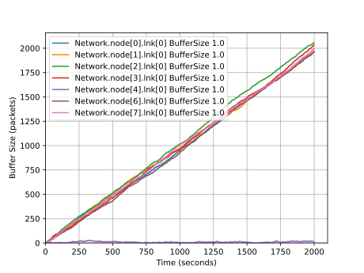 | **Un paquete cada 1 segundo:** en este caso, todos los nodos generadores excepto el 4 (quien no recibe nada) reciben 2 paquetes por segundo: el que genera su App y el que reciben de su vecino. Y como solo pueden enviar 1 paquete por segundo, sus buffers se comienzan a sobrecargar. |
| 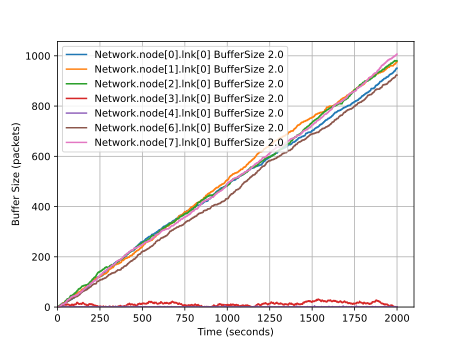 | **Un paquete cada 2 segundos:** en este caso, el nodo 3 recibe 2 paquetes cada 2 segundos: el que genera su App y el que recibe del 4, pero como su tasa de transmisión le permite despacharlos a ritmo de 1 paquete por segundo, su buffer no se llena. Luego, todos los nodos siguientes al 3 (en sentido horario) reciben 2 paquetes por segundo (el que generan + uno de su vecino), por ello es que se encuentran en la misma situación que el caso anterior, con sobrecarga. El 4 también está en la misma situación que antes, es más, está la mitad del tiempo sin hacer nada.  |
| 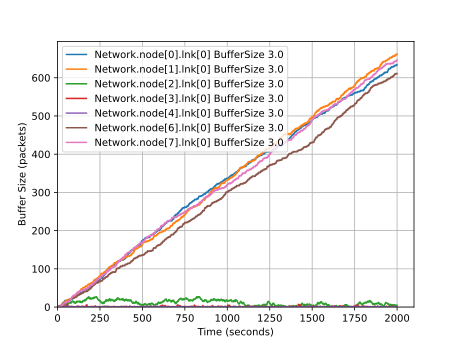 | **Un paquete cada 3 segundos:** este caso es igual que la situacion anterior, solo que aquí los nodos 4, 3 y 2 en conjunto producen un paquete por segundo (a este conjunto, que genera un paquete por segundo en promedio y que no se saturan, lo llamaremos **grupo productor**) y por lo tanto saturan aquellos que tienen por delante en sentido horario. |
| 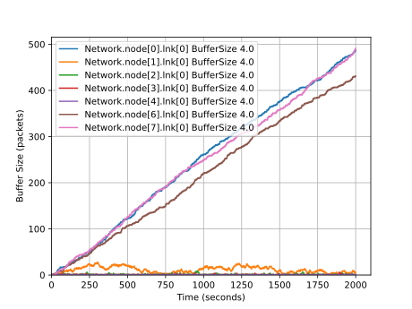 | **Un paquete cada 4 segundos:** igual al anterior, con el **grupo productor** conformado por los nodos 4, 3, 2, y 1, y el resto saturados. |
| 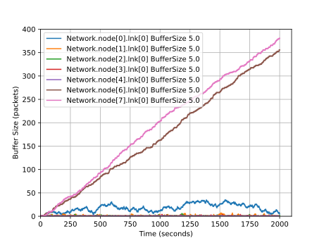 | **Un paquete cada 5 segundos:** ahora el grupo de los "productores" son los 4, 3, 2, 1 y 0 |
| 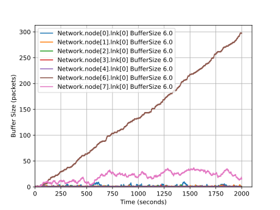 | **Un paquete cada 6 segundos:** se agrega el nodo 7 al grupo de los "productores" |
| 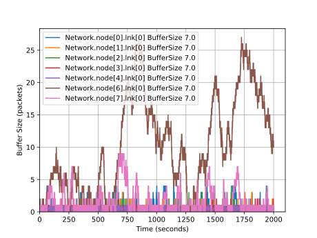 | **Un paquete cada 7 segundos:** aquí finalmente todos los nodos pueden manejar la carga que reciben, es decir, entre los nodos 4,3,2,1,0,7,6 generarán 1 paquete por segundo en promedio, y todas las partes de la red son capaces de manejarlo. La variación en los tamaños de buffers del gráfico es debida a la pequeña aleatoriedad del tiempo de generación de paquetes. |

Todos los gráficos de arriba se pueden resumir en el siguiente gráfico de delay medido, donde cada curva corresponde a uno de los intervalos de generación de paquetes analizado.

| Gráfico de delay medido | Explicación |
| ----------------------- | ----------- | 
| 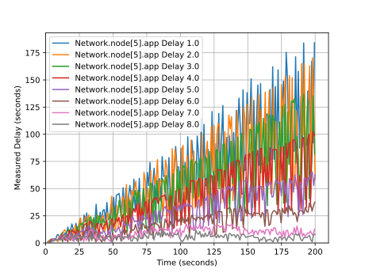 | Como se puede ver, el hecho de que cada vez se sumen más paquetes al "grupo productor" significa que hay menos buffers que se sobrecargan y por lo tanto los paquetes sufren cada vez menos tiempo de demora para llegar a su destino. Esto ocurre hasta alcanzar la establidad del delay (la función graficada deja de ser creciente) en los intervalos de generación de un paquete cada 7 o más segundos (rosa y gris). |

## Parte 2

### Nuestro algoritmo

**Algunos conceptos:**
- **Matriz de costos:** es una matriz almacenada en cada nodo que mapea una dirección al costo de llegar a ella a través de sus diferentes vecinos.
- **Mejores salidas:** es un vector, tambien almacenado en cada nodo, que mapea una dirección destino a la dirección del vecino por el que pasa el camino de menor costo. Estos son elegidos a partir de mínimos por fila en la matriz de costos.
- **Vector de distancia:** lo creamos a partir de las mejores salidas y la matriz de costos. Tiene pares < destino, costo al destino >.

**Explicación del algoritmo implementado:**
Nosotros hicimos una implementación similar al _algoritmo de enrutamiento de vector de distancia⁽¹⁾_ que vimos en el teórico, donde cada router recibe los vectores de distancia de sus vecinos, y a partir de estos arma su vector de distancia propio. Para representar los costos de las rutas nosotros decidimos usar como distancia la cantidad de saltos entre nodos.
Cada nodo usa como dirección su índice en la red (números del 0 al 7), esto lo hicimos porque necesitamos que cada nodo tenga una dirección única. Notar que _no asumimos nada con respecto a la posición de un nodo en base a su dirección_, son simplemente **identificadores**.
Cuando empieza la simulación, cada nodo envía paquetes **Hello** a sus vecinos. En estos paquetes cada nodo pone su dirección. A su vez, cuando recibe un paquete Hello, guarda la interfaz desde dónde llegó y la dirección del vecino que lo envió; también agrega a su **vector de distancia** que puede llegar a ese vecino con costo 1.
Cuando un nodo recibe un vector de distancia de un vecino, actualiza su **matriz de costos** y se fija si hay cambios en su vector de **mejores salidas**. En caso de haberlos, manda su vector de distancia actualizado a sus vecinos.

1. https://en.wikipedia.org/wiki/Distance-vector_routing_protocol

### Análisis de la parte 2

### Caso 1 de la parte 2
Mismo caso que la parte 1, nodos 2 y 0 generan y envían paquetes a nodo 5.

<video width="600" controls>
    <source src="graficos/Parte2-Caso1-Clip.mp4" type="video/mp4">
</video>

Como se puede ver en el video, esta vez con nuestro algoritmo en acción, se seleccionan los caminos más cortos y por lo tanto todos los paquetes enviados son recibidos sin demoras extra por esperas en bufers (salvo mínimas por aleatoriedad). No hay mucho para analizar aquí pues ninguna parte de la red se satura (el intervalo de generación aqui es de 1 paquete por segundo).

### Caso 2 de la parte 2

<video controls>
    <source src="graficos/Parte2-Caso2-Clip.mp4" type="video/mp4">
</video>

Volvemos a analizar la carga en buffers para distintos intervalos de generación, esta vez con nuestro algoritmo en acción.

A diferencia de la parte 1, donde todos los paquetes compartían un mismo camino, aquí se forman dos caminos (más cortos) por los cuales pasarán los paquetes. Es por ello que en los gráficos que se encuentran a continuación se puede ver que la estabilidad de la red se logra a partir del intervalo de generación de **1 paquete cada 4 segundos**, pues el camino más largo hasta el destino tiene 4 nodos y por lo tanto nunca habrá un "grupo productor" que genere más de 4 paquetes por segundo.

| Gráficos para distintos intervalos (aproximados) de generación de paquetes | Explicación |
| ------ | ------ |
| 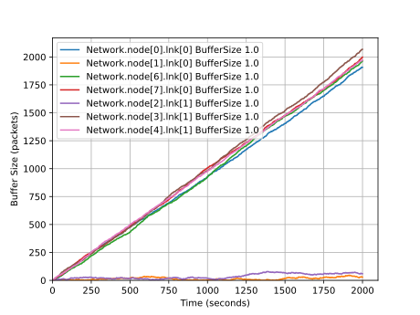 | **Un paquete cada 1 segundo**  |
| 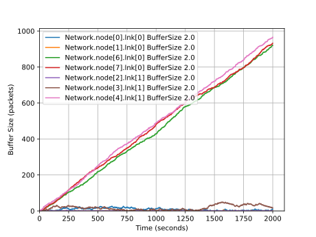 | **Un paquete cada 2 segundos** |
| 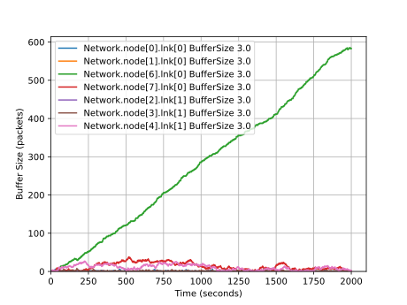 | **Un paquete cada 3 segundos** |
| 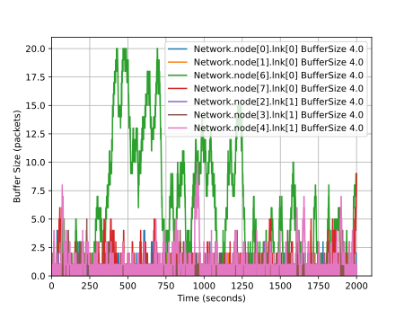 | **Un paquete cada 4 segundos** |
| 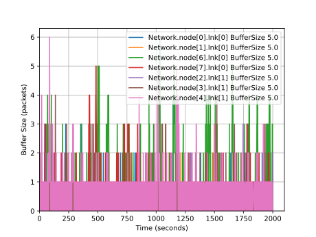 | **Un paquete cada 5 segundos** |

No ponemos los gráficos para más de 5 paquetes por segundo pues son todos de la misma forma debido a que ya se alcanzó la estabilidad.

| Gráfico de delay medido | Explicación |
| ----------------------- | ----------- | 
| 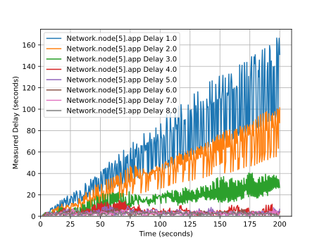 | Como se puede ver, ocurre lo mismo que en la parte 1, donde el delay medido depende de la cantidad de nodos saturados. Como deja de haber nodos saturados a partir del intervalo de generación de 1 paquete cada 4 segundos, el delay se estabiliza. |

## Comparaciones
**Algunas observaciones notables de la implementaciones:**

- El algoritmo implementado en el kickstart depende de la topología de la red (el hecho de mandar siempre por la interfaz 0 podría generar que nunca se llegue a destino en una red no-anillo). Por otro lado, nuestro algoritmo tiene mecanismos para aprender sobre la topología de la red y los caminos más cortos hacia el resto de los nodos.
- Nuestro algoritmo podría mejorarse para manejar las situaciones en las que algún nodo se cae o se incorpora un nuevo nodo. También estaría bueno que el algortimo decida la mejor ruta teniendo en cuenta la congestión de la red (es decir, que el costo no sea solamente la cantidad de saltos).

## Punto estrella: Network Star

<video controls>
    <source src="graficos/NetworkStarClip.mp4" type="video/mp4">
</video>

Para finalizar, aquí se puede ver nuestro algoritmo funcionando en una red con una topología más compleja.